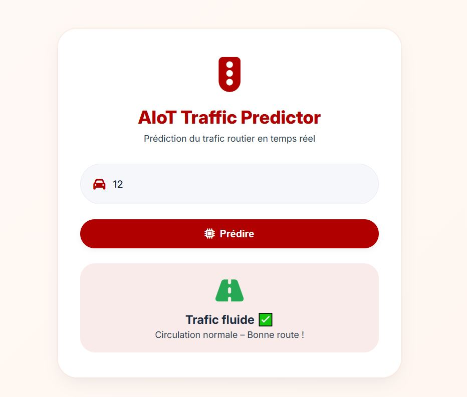
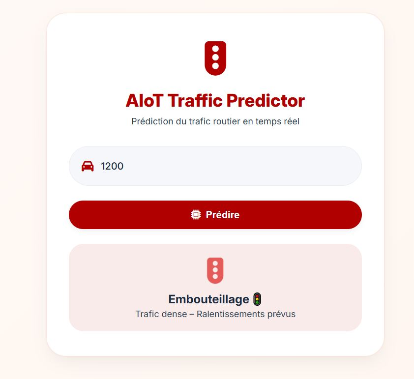
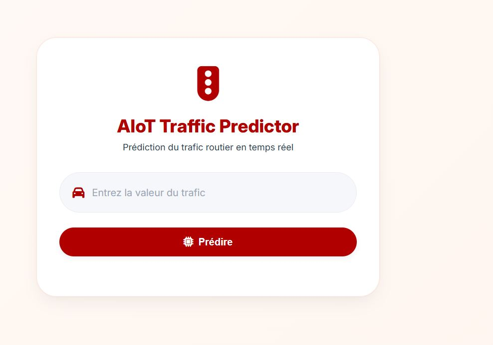

🚦 AIoT Traffic Predictor
Prédiction intelligente du trafic routier en temps réel
📌 Description

AIoT Traffic Predictor est une application innovante combinant les technologies de l’Intelligence Artificielle (IA) et de l’Internet des Objets (IoT) pour analyser et prédire l’état du trafic routier en temps réel.

Elle s’inscrit dans une logique de Smart City, en permettant d’anticiper les conditions de circulation (trafic fluide ou congestionné) à partir de données simples ou issues de capteurs intelligents.

🎯 Objectifs
🚀 Prédire l’état du trafic en temps réel
🏙️ Optimiser la gestion de la mobilité urbaine
🚗 Réduire les embouteillages
🎯 Fournir un outil d’aide à la décision rapide et efficace
⚙️ Fonctionnalités
🚗 Saisie dynamique du volume de trafic
🤖 Prédiction automatique basée sur un modèle IA
🟢 Indication de trafic fluide (circulation normale)
🔴 Détection des embouteillages
🎨 Interface moderne, ergonomique et intuitive
⚡ Résultats instantanés
🧠 Logique du système

L’application repose sur un modèle de classification simple :

Faible trafic → Circulation fluide
Trafic élevé → Embouteillage détecté

🔬 Perspectives d’évolution :

Intégration du Machine Learning (Random Forest, LSTM…)
Exploitation de données IoT réelles (capteurs, GPS, caméras)
🖥️ Interface utilisateur

L’application propose une interface épurée et facile à utiliser :

Champ de saisie du trafic
Bouton de prédiction
Affichage visuel du résultat avec indicateurs
📸 Aperçu de l'application
<h3 align="center">Interface & Résultats</h3> 
    

📊 Cas d’utilisation
🟢 Trafic fluide
Entrée faible (ex : 12)
Résultat : circulation normale
🔴 Embouteillage
Entrée élevée (ex : 1200)
Résultat : trafic dense avec ralentissements
🛠️ Technologies utilisées
HTML5 / CSS3 → Interface utilisateur moderne
JavaScript → Logique dynamique
IA → Modélisation prédictive (simulée ou réelle)
IoT → Intégration future de données temps réel
🚀 Améliorations futures
📍 Intégration de Google Maps API
📡 Données en temps réel via capteurs IoT
🧠 Modèles IA avancés (Deep Learning)
📊 Dashboard analytique intelligent
📱 Application mobile (Android / Flutter)
🌍 Cas d’utilisation
🏙️ Smart City (gestion du trafic urbain)
🚕 Projet Taxi Moya (RDC)
🚦 Systèmes de transport intelligents
📈 Analyse prédictive en temps réel
👨‍💻 Auteur

Maloani Saidi Georges

Expert Big Data | IA | IoT
CEO – MS Solutions Lab
Doctorant en Informatique

🔗 GitHub : https://github.com/Maloani

⭐ Contribution

Les contributions sont les bienvenues !

👉 N’hésitez pas à :

Forker le projet
Proposer des améliorations
Ouvrir des issues
